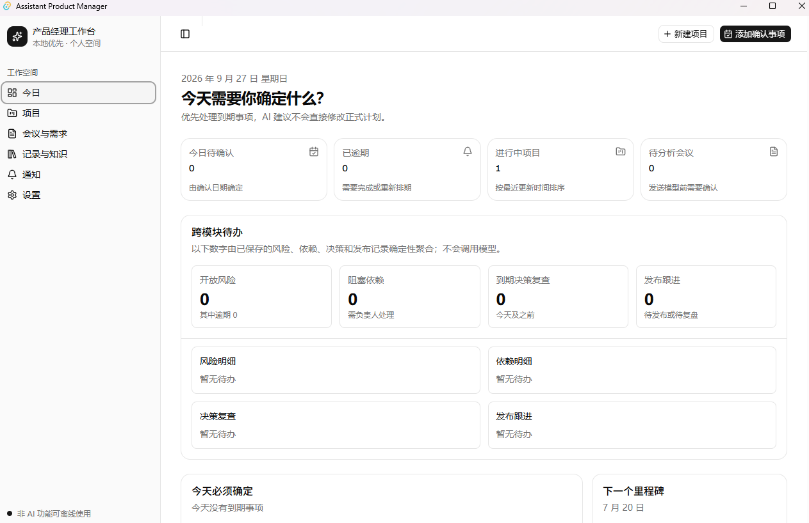
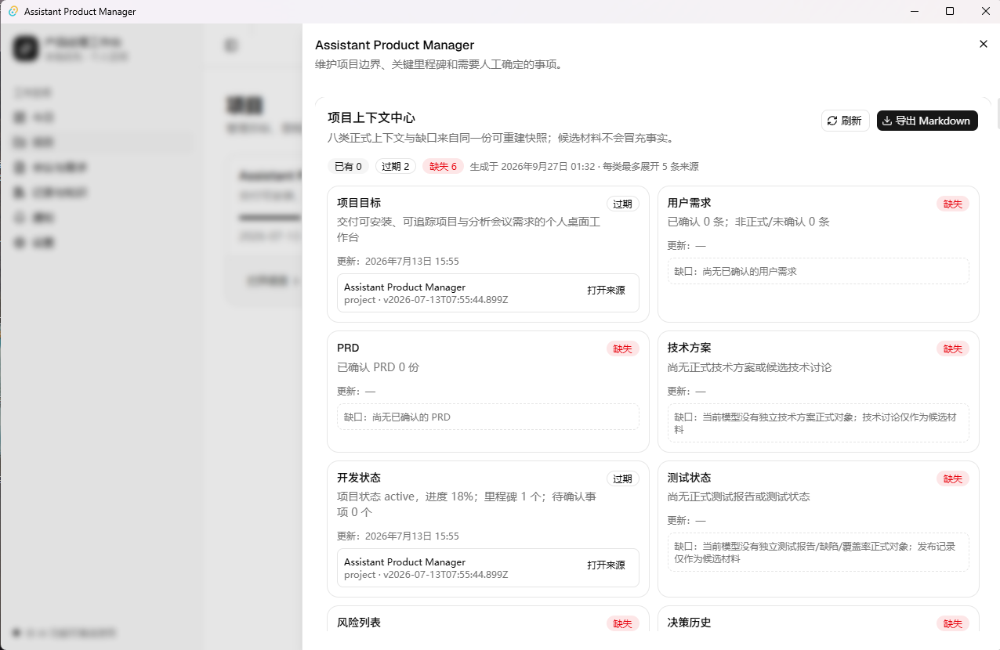

# AI Product Manager Workspace

> 本地优先的个人产品经理工作台：把分散的项目资料、会议、需求、决策与风险，组织成可追溯、可确认、可导出的项目上下文。



**当前版本：`v0.2.0 Source Preview`（源码预览，assets = 0）**

- 本仓库提供可复现源码、测试与验证命令。
- **不附带 Windows 安装包**，也不存在受支持的可下载安装器。
- 正式桌面二进制以未来 `v1.0.0` 干净机验收为门槛，不会用旧安装器冒充。

## 解决什么问题

产品经理同时推进多个 AI 项目时，困难的往往不是“再生成一份 PRD”，而是：信息散落在会议、文档和聊天里；结论缺少来源；AI 输出可能越权覆盖正式状态；隔一段时间后又要重新解释项目背景。

## 三条产品原则

1. **项目上下文优先**：在一个页面判断目标、需求、PRD、技术、开发、测试、风险、决策八类信息是已有、过期还是缺失。
2. **AI 只提案，人来确认**：AI 输出默认是草稿或候选，不能直接覆盖正式需求、决策和项目状态。
3. **本地优先且可追溯**：正式数据保存在本地 SQLite；来源、版本、项目边界和操作记录可以复核。

## 核心流程

```text
建立项目 → 导入/记录材料 → 形成正式知识 → 查看上下文缺口
        → 运行受限 Agent → 人工审核提案 → 导出/追溯版本
```



项目上下文中心不会用推断填补空白。缺少正式技术方案或测试报告时，它会明确显示“缺失”，即使存在相似候选材料也不会冒充事实。

## 技术栈

- Tauri 2 + Rust
- React 19 + TypeScript + Vite
- Tailwind CSS 4 + shadcn/ui
- SQLite（Tauri SQL / sqlx）
- 独立鉴权 Sidecar（仅回环地址）

## 从源码验证

前置：Windows 10/11，Node.js 22+，npm 10+，Rust stable MSVC（构建桌面壳时需要）。

```powershell
npm ci
npm --prefix sidecar ci

# 前端测试
npm test

# Sidecar 测试
npm run sidecar:test

# 完整预检（测试 + 迁移 + 安全 + 文档 + 构建 + 包体预算）
npm run verify:preflight

# 质量门禁（含 Rust fmt/check/test）
npm run quality
```

项目上下文契约（内存夹具，不需要真实用户数据库）：

```powershell
npm run verify:project-context
npm run verify:knowledge-contract
```

浏览器 UI 预览（数据在浏览器 localStorage，不读取桌面数据库）：

```powershell
npm run dev
# 或使用 START_MANUAL_TEST.cmd
```

## 数据与 AI 边界

- 正式业务数据保存在本地 SQLite；浏览器预览与桌面数据隔离。
- API Key 只保存在 Windows Credential Manager，不进入 React、SQLite、普通日志或备份。
- Sidecar 仅监听 `127.0.0.1`，每次进程使用随机会话令牌。
- AI 只生成草稿、解释和待审提案；人工确认前不改变正式状态。
- 无 Provider 时，记录、检索、确认、导出和备份仍可使用。

详见 [隐私与数据说明](./docs/PRIVACY_AND_DATA.md) 与 [架构与安全边界](./docs/ARCHITECTURE.md)。

## 当前限制

- **没有受支持的 Windows 安装器**；NSIS、升级、卸载、缩放和键盘路径属于后续 `v1.0.0` 门禁。
- 自动化测试通过不等于安装态验收通过。
- 面向单机个人工作区，不提供多人协作或云同步。
- 旧版 0.1.1 安装器不能代表当前源码行为，且不会作为本仓库发布物。

## 文档

- [用户手册](./docs/USER_GUIDE.md)
- [隐私与数据说明](./docs/PRIVACY_AND_DATA.md)
- [架构与安全边界](./docs/ARCHITECTURE.md)
- [数据库说明](./docs/DATABASE.md)
- [版本与发布边界](./docs/RELEASE_NOTES.md)
- [示例项目指南](./examples/README.md)
- [浏览器 UI 验收边界](./docs/acceptance/BROWSER_UI_ACCEPTANCE.md)
- [SVG 视觉验收边界](./docs/acceptance/SVG_VISUAL_ACCEPTANCE.md)
- [公开快照清单](./PUBLIC_SNAPSHOT_MANIFEST.md)
- [完整产品案例](./docs/CASE-STUDY.md)

## 许可证

第三方 UI/variant 说明见 [THIRD_PARTY_NOTICES.md](./THIRD_PARTY_NOTICES.md)。

源码、公开文档与自有截图采用 [MIT License](./LICENSE)。第三方依赖和素材保留各自许可证与必要声明。
