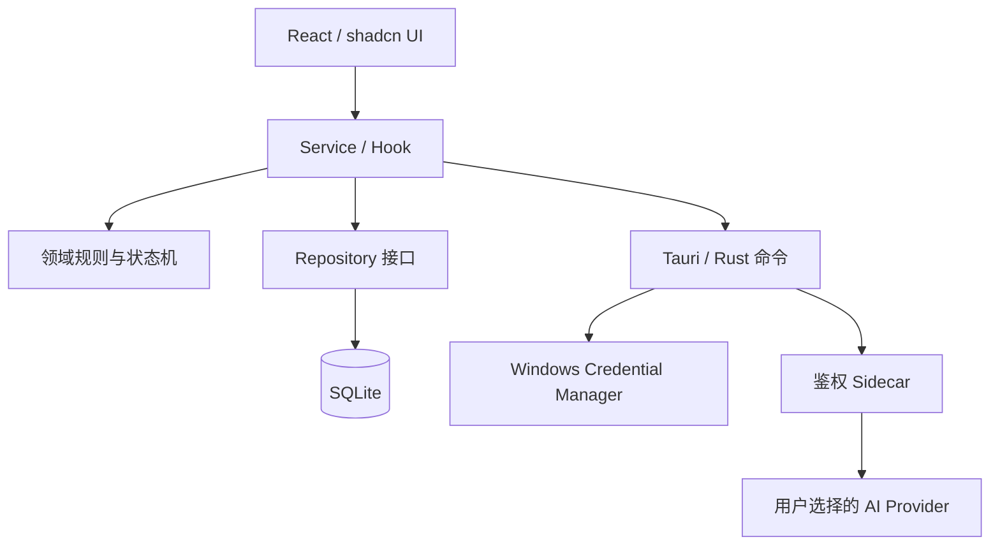
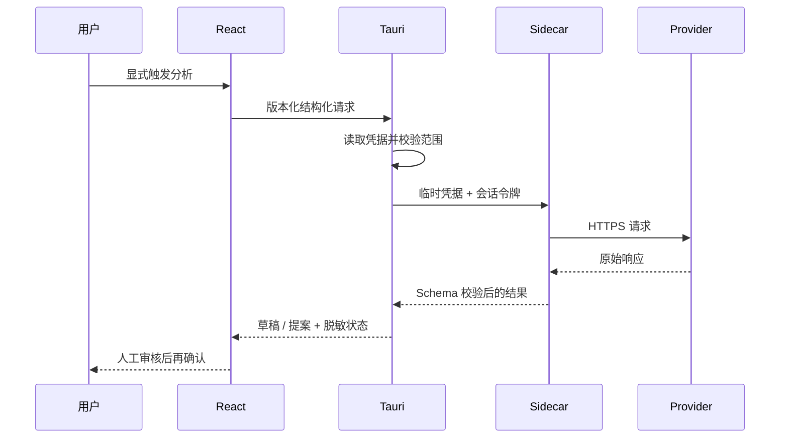

# 架构与安全边界

## 系统分层

- 领域规则不依赖 React、Tauri 或 SQLite，可独立测试。
- Repository 负责持久化、事务和数据映射；页面不散落 SQL。
- 高风险动作必须经过显式确认，UI 不能绕过。
- 浏览器适配器只用于开发预览，不是正式桌面数据源。

## AI 请求边界

## 关键安全策略

- API Key 只保存在 Windows Credential Manager，React 不读取已保存明文。
- Sidecar 只绑定 `127.0.0.1`，每次进程使用随机会话令牌。
- Trace 只记录状态、模型、耗时、Token 和脱敏摘要，不保存提示词全文或原始响应。
- 项目查询默认按 `project_id` 隔离，跨项目输入在领域层拒绝。
- migration 只追加；备份使用 SQLite 一致性快照。
- 向量/检索索引是可删除、可重建的派生数据，不是正式事实源。

## 当前发布边界

已具备浏览器验收、自动化预检和桌面架构，但最终 Windows 安装态仍需验证 NSIS、真实 Provider、Credential Manager、升级/卸载、系统缩放和通知跳转。案例仓不会把这些待验项描述成已完成。

